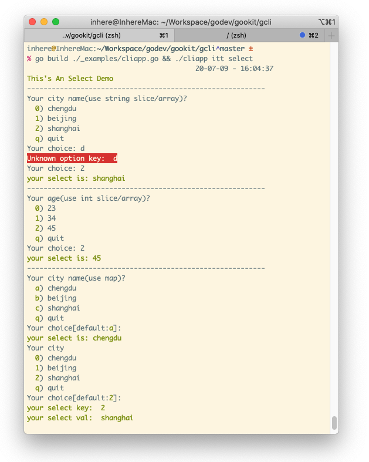

# interact

`interact` provides command-line interactive input helpers.

It includes common terminal interaction methods such as:

- `ReadInput`
- `ReadLine`
- `ReadFirst`
- `Prompt`
- `Confirm`
- `Query/Question/Ask`
- `Select/Choice`
- `MultiSelect/Checkbox`
- `ReadPassword`
- `Collector` and `cparam`

## Documentation

- GoDoc: https://pkg.go.dev/github.com/gookit/cliui/interact

## Install

```shell
go get github.com/gookit/cliui/interact
```

## New UI Layer

`interact/ui` is a new abstraction layer for backend-driven interaction components.

- package: `github.com/gookit/cliui/interact/ui`
- current backend: `github.com/gookit/cliui/interact/backend/plain`
- event-driven backend: `github.com/gookit/cliui/interact/backend/readline`
- `readline.New()` falls back to `plain` on non-TTY input
- `readline.NewStrict()` returns an error instead of falling back when a TTY is unavailable
- `Input` supports UTF-8 line editing and common shortcuts
- `Select` and `MultiSelect` support disabled items, defaults, navigation keys and visible selection status
- details: [interact-ui.md](interact-ui.md)

Bridge helpers are also available from the `interact` package:

- `NewUIInput`
- `NewUIConfirm`
- `NewUISelect`
- `NewUIMultiSelect`
- `NewUIPlainBackend`
- `NewUIReadlineBackend`
- `NewUIStrictReadlineBackend`
- `NewUIFakeBackend`

Use the root package helpers from `github.com/gookit/cliui` when tests or applications need to replace the default streams shared by `interact`, `interact/ui`, `show` and `progress`:

```go
cliui.CustomIO(in, out)
defer cliui.ResetIO()
```

## Quick Examples

### Read Input

```go
name, err := interact.ReadInput("Your name: ")
if err != nil {
	panic(err)
}
fmt.Println("name:", name)
```

### Prompt

```go
answer, err := interact.Prompt(context.Background(), "Environment", "dev")
if err != nil {
	panic(err)
}
fmt.Println("env:", answer)
```

### Confirm

```go
if interact.Confirm("Continue? ", true) {
	fmt.Println("confirmed")
}
```

### Question

```go
name := interact.Ask("Your name?", "guest", nil)
fmt.Println("name:", name)
```

Use `NewQuestion` when you need to configure or reuse a question:

```go
value := interact.NewQuestion("Your name?", "guest").Run()
fmt.Println(value.String())
```

### Select

```go
city := interact.SelectOne(
	"Your city?",
	[]string{"chengdu", "beijing", "shanghai"},
	"",
)
fmt.Println("city:", city)
```

### Multi Select

```go
services := interact.MultiSelect(
	"Choose services",
	[]string{"api", "worker", "web"},
	[]string{"api"},
)
fmt.Println("services:", services)
```

Use `NewSelect` directly when you need the selected key and value:

```go
s := interact.NewSelect("Choose env", []string{"dev", "prod"})
result := s.Run()
fmt.Println(result.KeyString(), result.String())
```

### Password

```go
password := interact.ReadPassword("Password: ")
fmt.Println("password length:", len(password))
```

### Collector

`Collector` groups several input parameters and runs them in order:

```go
c := interact.NewCollector()
err := c.AddParams(
	cparam.NewStringParam("name", "Your name"),
	cparam.NewChoiceParam("env", "Choose env").WithChoices([]string{"dev", "prod"}),
)
if err != nil {
	panic(err)
}
```

### UI Bridge

Use the bridge helpers when you want the new `interact/ui` components without importing subpackages directly:

```go
be := interact.NewUIReadlineBackend()

name, err := interact.NewUIInput("Your name").Run(context.Background(), be)
if err != nil {
	panic(err)
}

fmt.Println("name:", name)
```

### Full Select Example

```go
package main

import (
	"fmt"

	"github.com/gookit/color"
	"github.com/gookit/cliui/interact"
)

func main() {
	color.Green.Println("This's An Select Demo")
	fmt.Println("----------------------------------------------------------")

	ans := interact.SelectOne(
		"Your city name(use string slice/array)?",
		[]string{"chengdu", "beijing", "shanghai"},
		"",
	)
	color.Info.Println("your select is:", ans)
	fmt.Println("----------------------------------------------------------")

	ans1 := interact.Choice(
		"Your age(use int slice/array)?",
		[]int{23, 34, 45},
		"",
	)
	color.Info.Println("your select is:", ans1)

	fmt.Println("----------------------------------------------------------")

	ans2 := interact.SingleSelect(
		"Your city name(use map)?",
		map[string]string{"a": "chengdu", "b": "beijing", "c": "shanghai"},
		"a",
	)
	color.Info.Println("your select is:", ans2)

	s := interact.NewSelect("Your city", []string{"chengdu", "beijing", "shanghai"})
	s.DefOpt = "2"
	r := s.Run()
	color.Info.Println("your select key:", r.K.String())
	color.Info.Println("your select val:", r.String())
}
```

Preview:



## Related

- https://github.com/manifoldco/promptui
- https://github.com/chzyer/readline
